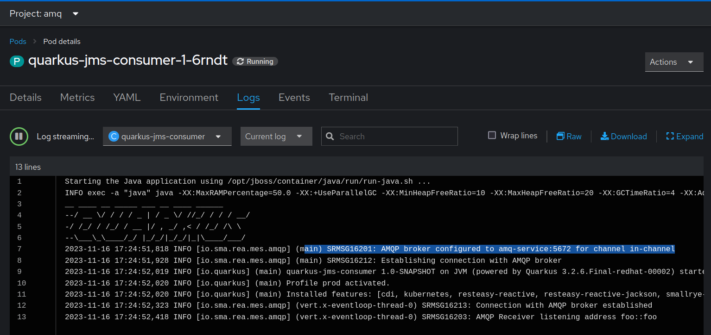
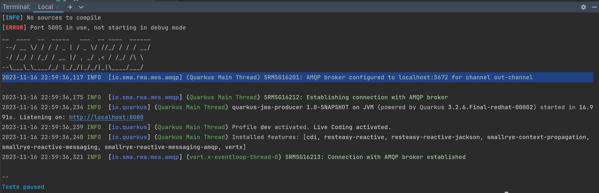
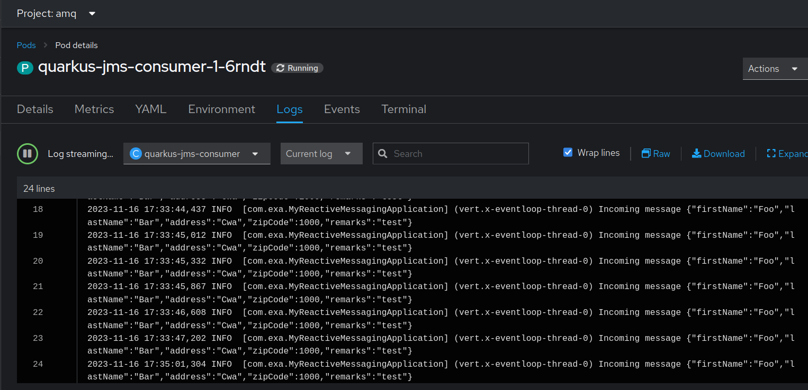

# Distributed AMQP clients, powered by skupper

 ##  Prerequisites
 - An AMQP 1.0 compliant broker running on local machine
 - Docker is installed on local machine
 - Skupper CLI is installed on local machine
 - Openshift/Kubernetes CLI client installed on local machine
 - A Kubernetes or Openshift cluster

 ## Procedure
 - Login to the Openshift cluster from a terminal
 ``oc login``
- Initialize Skupper in the selected namespace
 ``skupper init --enable-console --console-password=admin --enable-flow-collector``
- Initialize Skupper gateway for local services
 `` skupper gateway init --type docker
  ``
- Create and bind local service
``skupper service create amq-service 5672
  skupper gateway bind amq-service localhost 5672
  ``
- Deploy the quarkus-jms-consumer project to Openshift
 ``cd quarkus-jms-consumer && mvn clean install -Dquarkus.kubernetes.deploy=true -Dquarkus.kubernetes-client.trust-certs=true``
- The following screenshot shows that the application is connected to the local AMQ broker through 
  amq-service created with Skupper earlier.

- Run the quarkus-jms-producer application locally 
 ``cd quarkus-jms-producer && mvn quarkus:dev``

- The application running locally is connecting to the localhost as you can see from the screenshot.

- Call the rest API to send messages to the local application.

``curl --location 'http://localhost:8080/register' --header 'Content-Type: application/json' --data '{"firstName" : "Foo","lastName" : "Bar",
"address" : "Cwa",
"zipCode" : 1000,
"remarks" : "test"
}'
``

- At this point, the application running on Openshift should receive these messages. Check the application logs to confirm.

- The topology can also be viewed using the skupper web console.

